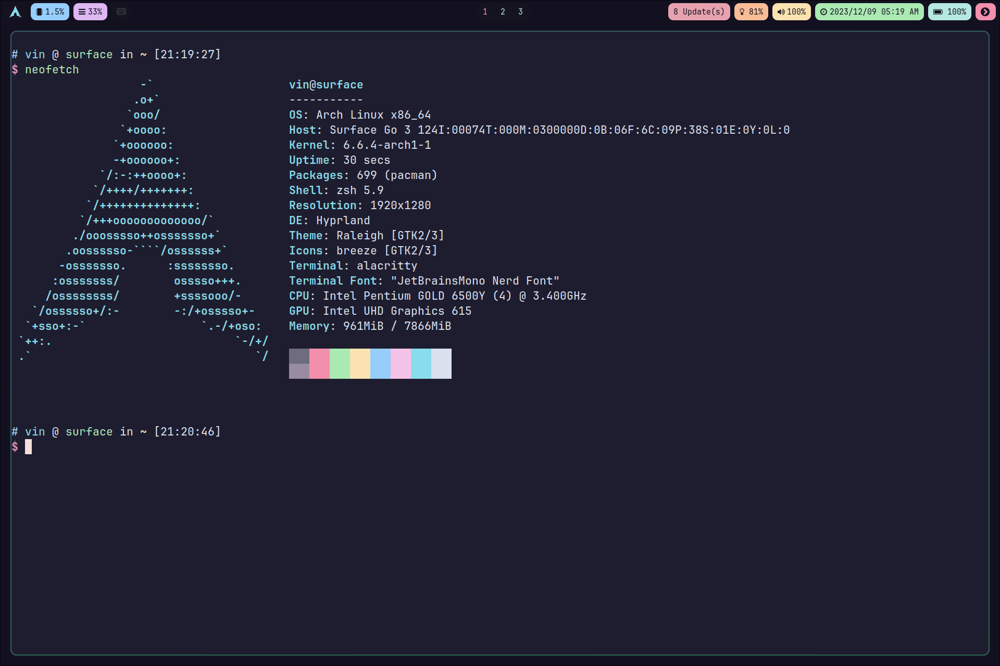
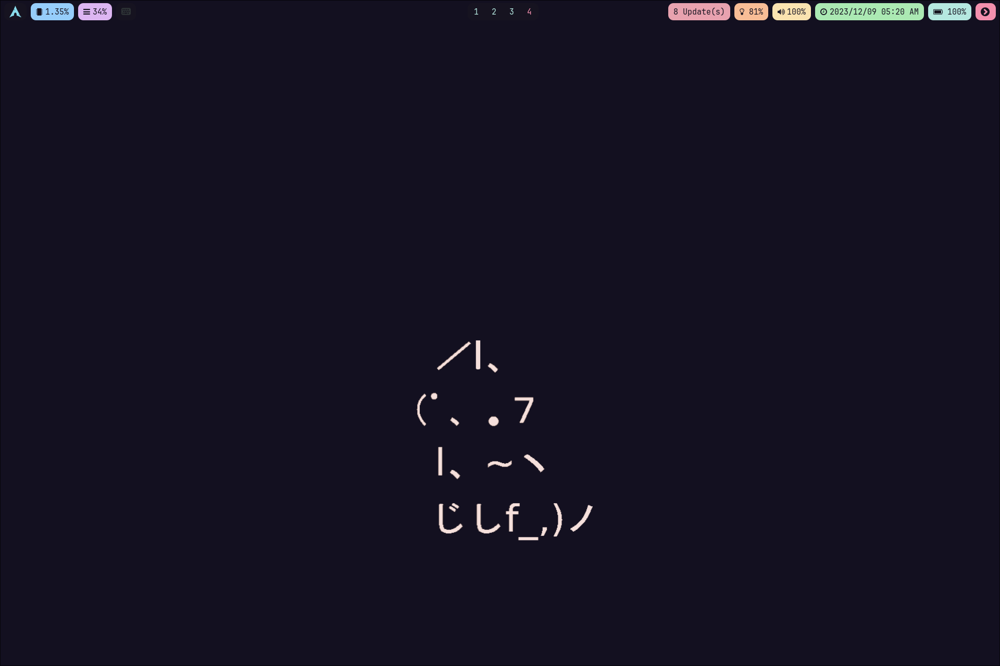
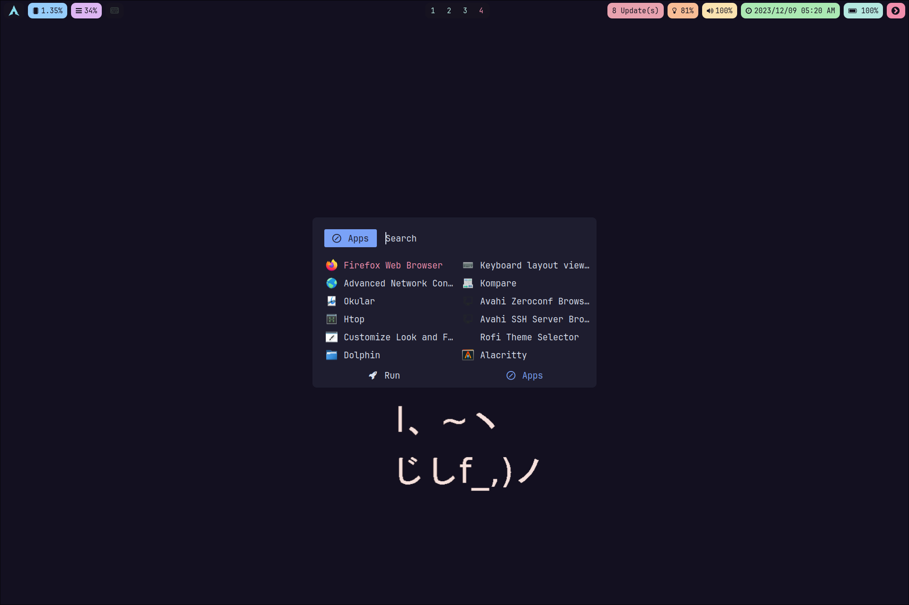

Dotfiles
=======

## Installation

```bash
$ ./install.sh
$ ./stow.sh
$ ./mirror.sh
```

## MacOS


## Linux







**Wayland** is Awesome!!!


## Programming Languages

Go, Rust, Ruby, Javascript are my primary programming languages, and correspondingly, I use [rvm](https://rvm.io) to manage ruby version, and [nvm](https://github.com/nvm-sh/nvm) to manage node version.

## Neovim

[Neovim](https://neovim.io) is my primary text editor, below are some existing features for demo:

* fuzzy finder & builtin terminal


* auto complete based on LSP 


