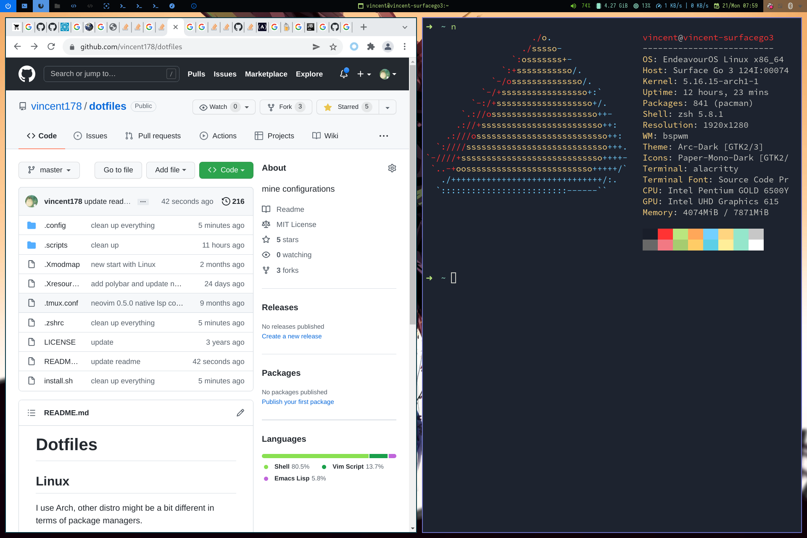
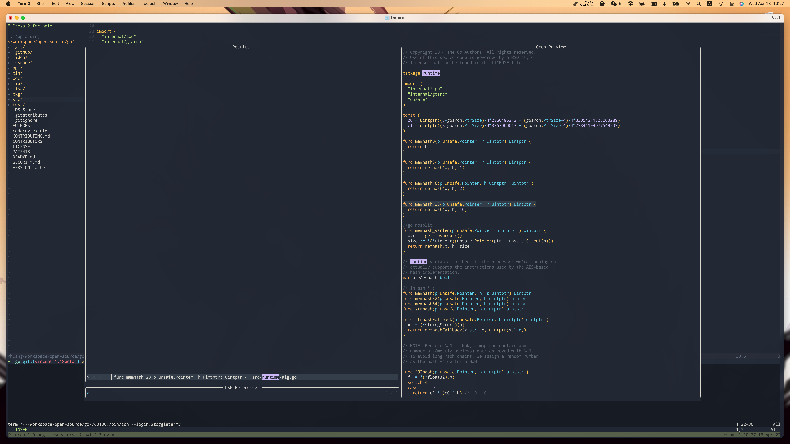
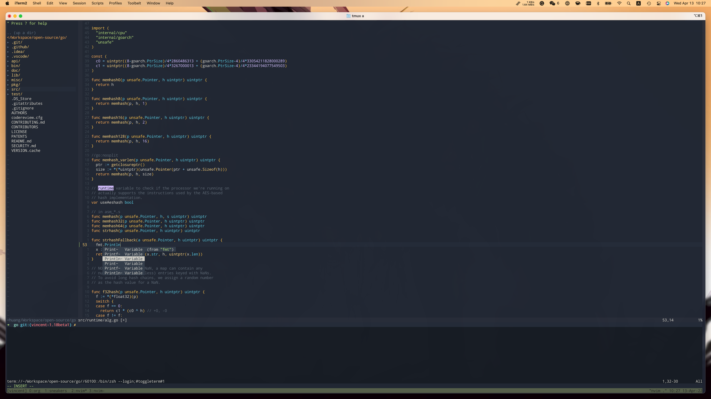

Dotfiles
=======

## MacOS


For Mac, I use [yabai](https://github.com/koekeishiya/yabai) window manager.

Before hit `./install.sh`, install homebrew first:

```bash
/bin/bash -c "$(curl -fsSL https://raw.githubusercontent.com/Homebrew/install/HEAD/install.sh)"
```

## Linux



I use Arch, other distro might be a bit different in terms of package managers.

Before hit `./install.sh`, install yay first:

```bash
pacman -S yay
```

## Programming Languages

Go, Ruby, Javascript are my primary programming languages, and correspondingly, I use [rvm](https://rvm.io) to manage ruby version, and [nvm](https://github.com/nvm-sh/nvm) to manage node version.

* install rvm
```bash
$ gpg2 --recv-keys 409B6B1796C275462A1703113804BB82D39DC0E3 7D2BAF1CF37B13E2069D6956105BD0E739499BDB
$ curl -sSL https://get.rvm.io | bash -s stable
```

* install nvm
```bash
$ curl -o- https://raw.githubusercontent.com/nvm-sh/nvm/v0.39.1/install.sh | bash
```

## Neovim

I use neovim as my primary text editor.

* fuzzy finder


* auto complete



## Tmux

I use tpm to manage tmux packages, install it first:

```bash
git clone https://github.com/tmux-plugins/tpm ~/.tmux/plugins/tpm
```
